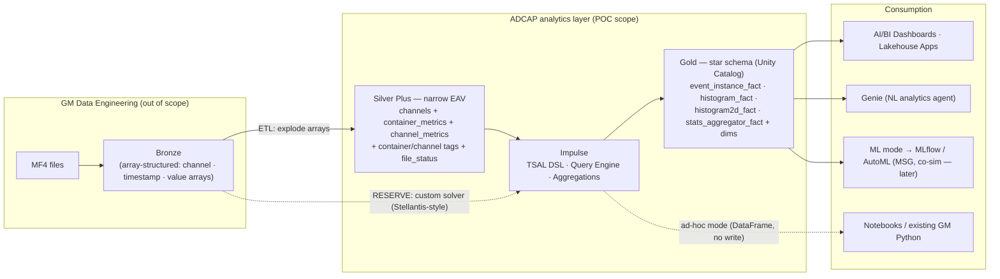

# ADCAP → Databricks Impulse POC — Needs, Proposal & Approach

**Status:** Draft for review
**Last updated:** 2026-10-01
**Framework:** Impulse (Databricks Labs) — this repo
**Companions:** `PROJECT_CONTEXT.md` = **source of truth** for the data model, decided scope, roles, and open questions · `GM_TO_DATABRICKS_REQUIREMENTS.md` = access + input-contract handoff · `IMPULSE_SCALING_AND_DESIGN.md` = Impulse scaling/design reference.

> This document covers **the need, why Impulse fits, what to build, and the approach/architecture.** It does **not** restate the data model, hierarchy, program scope, roles, or decisions — those live in **`PROJECT_CONTEXT.md`** (which supersedes this doc on any conflict).

---

## 1. Background & the need

GM's VSSM Calibration team analyzes vehicle time-series calibration data for ~300 calibrators (most of whom don't write Python). Today the workflow spans **three parallel tools**, all fed from raw **MF4** binary files:

| # | Tool | Role | Pain |
|---|------|------|------|
| 1 | **ETAS INCA / MDA** (manual) | Engineer eyeballs raw signal traces and manually root-causes | Fully manual, per-file, not scalable |
| 2 | **SPOT reports** | Scatter / 1D & 2D histograms / filtering / multi-file aggregation, driven by a spreadsheet config | Static HTML, re-run per dataset |
| 3 | **ADCAP Time Series Analyzer** (web) | Runs a GitHub repo of Python "tests" (KPIs) against files; tracks pass/fail/violations by software build | Reprocesses raw MF4 every time; results siloed in a local DB |

**Core problem:** every new test/investigation re-parses raw MF4 into a throwaway data frame. There is **no persistent, queryable store of computed results**, and results can't be cross-referenced with the rest of GM's data.

**The need (ranked by emphasis in scoping):**
1. **Eliminate repeated reprocessing** (top pain) — persist computed signals/KPIs, queryable on demand.
2. **Centralization** — join results to other GM data (e.g. manufacturing) instead of an island.
3. **Compute & scale** — slice large historical datasets on demand.
4. **Tool consolidation** — collapse the 3 tools into one system.
5. **Accessibility** — usable by non-Python calibrators.
6. **Faster ad-hoc investigation** — a ready store removes the write-a-script-and-reprocess bottleneck.

---

## 2. Why Impulse fits

**Yes — strongly, and for the exact layer the team owns.** MF4→bronze ingestion belongs to GM data engineering; ADCAP owns **everything after ingestion — the analytics layer** — which is where Impulse lives (*"Impulse sits between a governed silver layer and a gold-layer star schema in Unity Catalog"*). Impulse is purpose-built for large-scale **automotive** time-series on Spark+Delta (silver model co-developed with Mercedes-Benz), and its central design goal — **persist computed events/aggregations to queryable gold tables and recompute incrementally** — is a direct answer to pain #1.

| ADCAP need | Impulse capability | How |
|---|---|---|
| **Stop reprocessing; persist results** | **Reporting mode → gold star schema** + **incremental processing** | Events & aggregations computed once and persisted to Delta fact/dimension tables. Incremental runs (`definition_hash_comparator`, `container_detector`) recompute **only** changed containers/definitions — adding/altering one test no longer re-runs everything. |
| **Queryable, centralized (vs. "island")** | **Gold layer in Unity Catalog** | `event_instance_fact`, `histogram_fact`, `histogram2d_fact`, `stats_aggregator_fact` + dimensions are ordinary UC Delta tables — joinable to any GM data, queryable without touching raw files. |
| **ADCAP "Tests"/KPIs — Concern/Failure thresholds, violations** | **Events** (`BasicEvent`, `SequenceOfEvents`, `PointsInTimeEvent`, `ContainerEvent`) | A test's boolean (e.g. `VeSCRD_r_EffDiffRGN_SCR2 < 0.45`) → a `BasicEvent`; each true interval = a violation in `event_instance_fact`. Concern vs. Failure = two thresholds. Pass/fail/violation KPIs = aggregating instances. |
| **"Did X happen one loop before Y"** | `SequenceOfEvents` + narrow per-sample model | Query engine aligns channels at different loop rates on real timestamps; `SequenceOfEvents` captures ordered transitions. |
| **SPOT: 1D-hist, scatter, filtering, multi-file** | **Aggregations + events** across all matching recordings | 1D-hist → `HistogramDuration`/`HistogramDistance`; scatter → synchronized samples (ad-hoc / `PointValueAggregator`); SPOT Filter 1–5 (AND) → a `BasicEvent` scoping the aggregation. **2D-hist is a partial fit — see §4.4.** |
| **Custom signals (SPOT algebra)** | **TSAL virtual signals + `CalculatedChannel`** | `Coolant_dT = VeEECR_T_EngArbitrated − VeEECR_T_EngInletCoolant` is one TSAL line; `CalculatedChannel` materializes it as a persisted channel. NumPy-style math supported. |
| **Exact timing for (co-)simulation** | **Narrow per-sample silver model** | `(container, channel, timestamp, value)` grain keeps original timing; downsampling is opt-in per aggregation. |
| **Software-build correlation** | **Container/channel tags + dimensions** | Build revision rides as a container tag; every result sliceable by it — matching ADCAP's build-vs-pass/fail view. |
| **Accessibility for non-Python calibrators** | **Gold → AI/BI Dashboards, Lakehouse Apps, Genie** | Reporting output is dashboard/Genie-ready; agents author **TSAL** given well-described tags/metrics metadata (see `IMPULSE_SCALING_AND_DESIGN.md` §5). |
| **Ad-hoc "dig into a thread"** | **Ad-hoc analysis mode** | TSAL → Spark/pandas DataFrame in a notebook, no gold write. (Validates the open "faster than local?" question.) |
| **MSG / ML / co-simulation** | **ML mode** | Event-scoped stats + histogram distributions → flat feature matrix for MLflow/AutoML. |
| **Keep GM's existing Python** | **Pure library** | Runs in notebooks/jobs; scripts re-point from raw MF4 to UC tables. |
| **Agent-authored tests** | **Agent Skills** (`skills/`) | Teach Genie Code / Claude to author TSAL events & aggregations — a path to auto-generating "tests" from natural language. |

**Net:** close to 1:1, with one partial — the SPOT 2D-hist per-cell Z-statistic (§4.4).

---

## 3. Scope

Of GM's **three** MF4 analysis methods, the POC targets **two**:
1. **SPOT reports** — plots configured in the `SPOT_INPUT` workbook's **Template Plots** tab (§4.3).
2. **Time Series Analysis** — the GM KPI/Python "tests" in `GM-SDV/etc-time-series-tests`.

**Manual INCA/MDA analysis is out of scope** (interactive trace inspection; Impulse ad-hoc can support that style later, but reproducing INCA isn't a POC goal).

**In scope** (analytics layer, post-ingestion): build the narrow silver from bronze → run Impulse → produce gold; reproduce a representative subset of tests/KPIs and SPOT plots; validate parity vs. the current ADCAP tool; stand up a thin dashboard/Genie surface + a notebook ad-hoc example.

**Out of scope:** MF4→bronze ingestion (data eng), migrating all programs, replicating the ADCAP web UI, a calibrator-facing Genie agent, MSG/co-sim ML.

> Program pick, data volumes, hierarchy, and roles are in **`PROJECT_CONTEXT.md` §2–§9** (decided program: `DK68`; ~10 indicative containers with all channels + 2–3 known-stable tests).

---

## 4. What to build (functional requirements)

### 4.1 Persistent computed-signal & KPI store
- Compute derived signals and KPIs **once**, persist to queryable UC tables (silver/gold).
- Track lineage: result ↔ file ↔ program ↔ device ↔ **software build** (correlate pass/fail to builds — a valued ADCAP capability).
- Incremental reprocessing when a test definition changes (today = full re-run).

### 4.2 Test / KPI computation (ADCAP "Tests")
- Reproduce the GitHub-repo model: tests in **`GM-SDV/etc-time-series-tests`** (Python), resolved by branch/sha, discovered per program. Each encodes a **Concern** and a **Failure** threshold → boolean/violation. Examples observed:
  - `test_p0171_system_too_lean_bank1` — P0171 System Too Lean Bank 1.
  - `test_p134b_nox_catalyst_efficiency_during_regen` — Concern `VeSCRD_r_EffDiffRGN_SCR2 < 0.45`; Failure `OeSCRR_r_EffDiff_EWMA_RGN_SCR2 < 0`.
  - `test_p0128_ect_below_thermostat` — Concern/Failure on `NsETHD_h_EOR_WarmUpDiagData.a_r_PassRatioFOM[…]`.
- Modules observed: `test_boost / combmode / coolant / dpf / egr / fuel_pressure / fueling / idle_quality / maf / o2_nox_sensor / oil_catalyst / scr / spec_range / torque_response / torque_validation.py`.
- Emit KPIs the team relies on: **violation distributions, pass rates, fail rates, FOM**, run counts, distinct files, durations — sliceable by program / module / test / device class / software revision.

### 4.3 SPOT aggregate reporting (Template Plots)
SPOT renders a Plotly HTML report; the driving tab is **Template Plots**, where **1 row = 1 plot**. Reference output: `LS6_July_HOT_OTR-plots.html` = **76 plots** (45 2D Histogram, 28 Scatter, 3 1D Histogram). Each row defines:
- **Plot Type** (`2D Histogram` / `Scatter Plot` / `1D Histogram`).
- **Analyzed signal** (Z/color value, or 1D-binned signal) — often a custom signal (`V8_CA50_EA`, `CA50_ANNmnsMeas`).
- **X / Y channels** (typically RPM `VeEPSI_n_LoresI` × air `VeMAFR_m_AirPerCylCurEst_Trpd`), **Z min/max**, **X/Y bin break points**.
- **Plot Stat Type** — `Min` / `Max` / **`Mean`** — the per-cell statistic.
- **Filter 1–5** (`Variable | Equal/Not Equal/Min/Max | value`, **AND-combined**, e.g. `VeFULR_Cnt_NumOfCylsBeingFueled == 8` AND `VeTCOC_b_DFCO_Enabled != 1` AND `VeSPRK_phi_TotalTrqRequests == 0`) + a **Delta Threshold Filter**; colormap, units.

Impulse mapping: each row → a `Page` aggregation; **Filters 1–5** → a `BasicEvent` scoping it; **custom-signal** channels → `CalculatedChannel`. The tab becomes a small config-driven generator emitting Impulse aggregations — a natural POC deliverable. Reproduce with **multi-file / multi-trip aggregation** and the same binning + filters.

### 4.4 Known gap — SPOT 2D-histogram = a *binned statistic of a Z-signal*
SPOT colors each (RPM, Air) cell by the **Mean/Min/Max of a third signal Z**. Impulse's native `Histogram2D` (`Duration`/`Distance`/`CustomWeights`) accumulates a **weight** per cell (occupancy), **not** a statistic of a separate Z — so this plot is **not** a drop-in. Options, by fidelity/effort:
1. **Duration-weighted mean via two custom-weights passes** — one `Histogram2DCustomWeights` weighted by `Z` (`weight_type="time"` → Σ Z·dt), one by duration (Σ dt), divided cell-wise. Gives a *duration-weighted* mean (confirm with GM whether SPOT's "Mean" is sample- or time-weighted). **Doesn't cover Min/Max.**
2. **A small binned-statistic-2D extension / ad-hoc implementation** — pull synchronized X/Y/Z `SampleSeries` and apply per-cell `mean/min/max` (e.g. `scipy.stats.binned_statistic_2d`). Most faithful; a candidate to contribute back. Prototype in ad-hoc mode first.

This is the **one partial fit** and should be an early, explicit POC task — not discovered late.

### 4.5 GM business rules from `SPOT_INPUT` (codify as transforms)
The workbook is GM's business logic as a spreadsheet DSL:
- **Custom Signals** — algebraic derived signals (`Coolant_dT`, `MinAir_Violation`, `MAP_Pred_*_Err`, per-cylinder `CA50` averages), today `SDF['signal']` (Python/NumPy). → TSAL / `CalculatedChannel`.
- **Filters** — global include filters (Equal/Min/Max). → event scoping / container filters.
- **Anomaly Detection** — named boolean logic per signal. → events.
- **Channel List** — extra channels to process (e.g. knock octane scalers per cylinder/zone).
- **Aliases** — master → ordered alias fallbacks. → Impulse channel aliasing.
- **MSG (Missing Signal Generator)** — ML to synthesize a missing channel (nice-to-have / later → ML mode).

### 4.6 Macroscope → microscope drill-down
High-level KPI view first, then drill into a trip → time window → signal traces. Must be at least as fast/easy as current tooling (the agreed bar).

### 4.7 Preserve GM Python
Existing Python keeps working inside Databricks once tables are in Unity Catalog — scripts re-point from a raw MF4 file to the correct UC table. No functionality lost.

### Representative tests/plots to reproduce (parity set — final list TBD with GM)
- Fueling/lean: `test_p0171_system_too_lean_bank1` · SCR/NOx: `test_p134b_nox_catalyst_efficiency_during_regen` · Coolant: `test_p0128_ect_below_thermostat`.
- SPOT aggregates: EGR Valve Area, Avg Octane Scaler, IAT/ECT spark offset (2D-hist + scatter over RPM × AirPerCyl).
- Validation target: KPI values, pass/fail/violation counts, and 2D-hist cell values **match** the ADCAP tool / `LS6_July_HOT_OTR-plots.html` for the same files/builds.

---

## 5. Architecture

MF4→bronze is owned by GM data engineering (out of scope). The POC owns everything from bronze onward. Per the decided approach (**`PROJECT_CONTEXT.md` §2**): build a **narrow EAV "Silver Plus"** model **from bronze** via a minimal ETL (bronze is already near-long — arrays per channel — so the ETL is essentially an **explode**). The **custom solver is a reserve fallback**, not the plan.

**Three usage modes, one core** (same TSAL + query engine):
- **Reporting** — parallel compute across recordings, persisted to gold; schedulable as a Workflow. *(Replaces the ADCAP Tests/KPI engine and SPOT report generation.)*
- **Ad-hoc** — TSAL live to a DataFrame, no writes. *(Replaces laptop-local Python microscope work.)*
- **ML** — event-scoped stats/histograms as a feature matrix. *(Future MSG / co-sim.)*

**Connection decision (summary):** Option 1 = **ETL bronze → narrow Silver Plus** (chosen; cleanest, best Spark pruning and agent performance). Reserve = **custom solver** reading GM's existing layout directly (proven at Stellantis; being streamlined in impulse#109). Rationale, trade-offs, and data-discovery asks: `PROJECT_CONTEXT.md` §2 and `GM_TO_DATABRICKS_REQUIREMENTS.md` §5.

---

## 6. Phased approach

- **Phase 0 — Enablement, access & data discovery.** GitHub contributor on `GM-SDV/etc-time-series-tests`; Databricks catalog/schema/workspace access; example bronze data + schema; extra-metadata inventory (ECU build, track, fleet, vehicle). *(See `GM_TO_DATABRICKS_REQUIREMENTS.md` §1, §5.3.)*
- **Phase 1 — Bronze → Silver Plus.** Build the ETL to **explode** the array-structured bronze into the narrow `channels` + `container_metrics` + `channel_metrics` + tags (+ `file_status`); carry build/vehicle/trip/program as tags; verify cross-ECU time alignment on a known trip. *(Daria + Brian own this.)*
- **Phase 2 — Baseline Impulse pipeline.** Configure `ImpulseConfig`; run reporting with a couple of `ContainerEvent`-scoped histograms to prove bronze→silver→gold end-to-end.
- **Phase 3 — Reproduce GM business logic.** Custom Signals → TSAL/`CalculatedChannel`; a subset of Python tests → events + `StatsAggregator` KPIs; SPOT plots (1D/scatter directly; 2D-hist via §4.4); **validate parity**. *(Thomas Bonford owns the silver→gold test-translation.)*
- **Phase 4 — Surface it.** AI/BI Dashboard (or Lakehouse App) over gold (macroscope) + a notebook ad-hoc drill-down (microscope); **measure** against current tooling.
- **Phase 5 — Incremental & scale readiness.** Demonstrate an incremental run (change one test → only affected containers recompute); document onboarding the next program.

---

## 7. Success metrics

> **🚧 Placeholder — to be defined with GM.** Quantitative targets (e.g. parity tolerance, runtime/latency, cost, calibrator time-to-answer) will be added here once agreed.

**Provisional acceptance criteria (qualitative, until formal metrics land):**
1. One program flows bronze → Silver Plus → Impulse → gold, with cross-ECU timing verified.
2. A subset of tests/KPIs and SPOT plots reproduced in Impulse, **matching** the ADCAP tool for the same files/builds (define the match tolerance).
3. KPIs **queryable from gold without reprocessing raw data**, and joinable to other UC data.
4. Macroscope → microscope demonstrated **and measured** against current tooling (the agreed bar: if it isn't faster/easier, there's no reason to move).
5. An incremental run recomputes only what changed when a test definition changes.
6. A re-pointed GM Python script reproduces a result against a UC table.

---

## 8. Risks & open questions
- **SPOT 2D-hist per-cell Z-statistic (§4.4)** — the one partial fit; needs an extension/ad-hoc impl for Mean, more for Min/Max. Confirm SPOT's "Mean" semantics (sample vs. time-weighted).
- **Table ownership & schema evolution** — who owns/evolves the calculated-channel/KPI tables; may need its own session. *(PROJECT_CONTEXT §11.)*
- **Is ad-hoc genuinely faster in Databricks?** — validated in Phase 4, not assumed.
- **Bronze layout & fidelity / labeling gaps** — depends on parsed metadata; some labeling is manual. *(PROJECT_CONTEXT §11.)*
- **Framework support model** — Impulse is Databricks Labs, AS-IS (no SLA); EU authors (Thomas Bonford) can be pulled in.
- **Runtime** — Serverless Environment Version 2+ (Python 3.12, PySpark 4.0, Delta 4.0).

## 9. Longer-term (post-POC, not committed)
- Natural-language **Genie** agent calibrators query directly — requires codified context (data, signals, calculations) first. Genie = analytics agent, not a data-engineering agent (won't create persistent KPI tables itself).
- ML / co-simulation (feed preserved-timing data back into ECU software simulation). Adjacent teams in `PROJECT_CONTEXT.md` §12.

## 10. Immediate next steps
1. Confirm access (GitHub + Databricks catalog/workspace) — Phase 0.
2. Get example bronze data + schema and the extra-metadata inventory.
3. Select the 3–5 tests/KPIs + SPOT Template-Plots rows for the parity set.
4. Build the Phase 1 explode ETL on the pruned subset; stand up the Phase 2 baseline.
5. **Define the Success Metrics (§7) with GM.**
