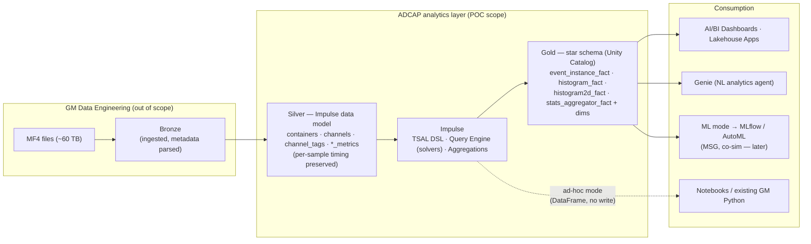

# ADCAP → Databricks Impulse POC — Proposal, Approach & Architecture

**Status:** Draft for review
**Last updated:** 2026-09-03
**Companion doc:** [`ADCAP_POC_REQUIREMENTS.md`](./ADCAP_POC_REQUIREMENTS.md) (the need this proposal answers)
**Framework:** Impulse (Databricks Labs) — this repo, `v0.6.0`

---

## 0. TL;DR — Can Impulse help the ADCAP team?

**Yes — strongly, and for the specific layer the ADCAP team owns.** MF4 → bronze ingestion is done by GM's data-engineering team; ADCAP is focused on **everything after ingestion — the analytics layer**. That is exactly where Impulse lives:

> *Impulse sits between a governed silver layer and a gold-layer star schema in Unity Catalog.*

Impulse is a Databricks Labs library **purpose-built for large-scale automotive time-series analytics on Spark + Delta** (the silver-layer model was co-developed at petabyte scale with Mercedes-Benz). Every one of ADCAP's core needs maps onto a first-class Impulse primitive — and the framework's central design goal (persist computed events/aggregations to queryable gold tables, recompute incrementally) is a direct answer to ADCAP's #1 pain point: **repeated reprocessing of raw data with no persistent, queryable results.**

---

## 1. Why it fits (fit assessment)

The ADCAP team's need decomposes into: *stop reprocessing raw files*, *persist computed KPIs/signals in a queryable store*, *reproduce SPOT-style aggregate reports and the Python "tests"*, *preserve exact cross-ECU timing*, *make it usable by non-Python calibrators*, and *keep ad-hoc drill-down fast*. Impulse addresses each directly:

| ADCAP need (from requirements doc) | Impulse capability | How |
|---|---|---|
| **#1 Stop reprocessing raw MF4 every time; persist results** | **Reporting mode → gold star schema** + **incremental processing** | Events & aggregations are computed once and persisted to Delta fact/dimension tables. Incremental runs (`definition_hash_comparator`, `container_detector`) recompute **only** changed containers or changed definitions — so adding/altering one test no longer re-runs everything. |
| **Queryable, persistent results ("island" → centralized)** | **Gold layer in Unity Catalog** | Fact tables (`event_instance_fact`, `histogram_fact`, `histogram2d_fact`, `stats_aggregator_fact`) + dimensions are ordinary UC Delta tables — joinable to *any* other GM data (e.g. manufacturing) and queryable without touching raw files. |
| **ADCAP "Tests" / KPIs — Concern & Failure thresholds, violations** | **Events** (`BasicEvent`, `SequenceOfEvents`, `PointsInTimeEvent`, `ContainerEvent`) | A test's boolean condition (e.g. `VeSCRD_r_EffDiffRGN_SCR2 < 0.45`) becomes a `BasicEvent`; each interval where it's true is a violation instance in `event_instance_fact`. Concern vs. Failure = two events/thresholds. Pass/fail/violation-rate KPIs come from aggregating those instances. |
| **"Did X happen one loop before Y" — cross-ECU sequencing** | `SequenceOfEvents` + narrow per-sample silver model | The query engine aligns channels recorded at different loop rates on their real timestamps; `SequenceOfEvents` captures ordered state transitions. Timing is preserved (see below). |
| **SPOT reports: 2D-hist, scatter, 1D-hist, filtering, multi-file** | **Aggregations** + **events** run in parallel across all matching recordings | 1D-hist → `HistogramDuration`/`HistogramDistance`; scatter → synchronized channel samples (ad-hoc / `PointValueAggregator`); SPOT's Filter 1–5 (AND-combined) → a `BasicEvent` boolean scoping the aggregation. **Caveat on 2D-hist — see §4.1:** SPOT colors each RPM×Air cell by the *Mean/Min/Max of a third signal Z*; Impulse's native `Histogram2D` is occupancy/weight-based (duration/distance/custom-weight), so per-cell mean-of-Z needs a small extension (custom-weights ratio for a weighted mean, or a binned-statistic aggregation) — **the one place the fit is partial, not 1:1.** |
| **Custom Signals (SPOT algebraic derived signals)** | **TSAL virtual signals** + **CalculatedChannel** | `Coolant_dT = VeEECR_T_EngArbitrated − VeEECR_T_EngInletCoolant` is a one-line TSAL expression; `CalculatedChannel` materializes it as a new persisted channel (same per-sample grain) so it's reusable and queryable. NumPy-style math is supported. |
| **Exact timing preserved for (co-)simulation** | **Silver per-sample model + RLE data type** | The narrow `(container, channel, tstart, tend, value)` grain keeps original sample timing; downsampling is opt-in per aggregation, not forced on ingestion. |
| **Software-build correlation** | **Container/channel tags + dimensions** | Software/build revision rides as a container tag; every event/aggregation is sliceable by it in the gold dimensions — matching ADCAP's build-vs-pass/fail trend view. |
| **Accessibility for ~300 non-Python calibrators** | **Gold star schema → AI/BI Dashboards, Lakehouse Apps, Genie** | Reporting output is dashboard/Genie-ready. Genie (analytics agent) can answer natural-language questions over the persisted KPI tables — the "macroscope" and the eventual calibrator-facing agent. |
| **Ad-hoc "dig into a thread" (microscope)** | **Ad-hoc analysis mode** | TSAL evaluated directly by the query engine → Spark/pandas DataFrame in a notebook, **no gold write**. This is where we validate the open question: *is Databricks genuinely faster for ad-hoc than local tooling?* |
| **MSG (Missing Signal Generator) / ML / co-simulation** | **ML mode** | Event-scoped stats and histogram distributions extract as a flat feature matrix for MLflow / AutoML — the natural home for MSG-style signal synthesis, later in the roadmap. |
| **Keep GM's existing Python** | **Pure library, no CLI/bundle** | Impulse runs inside notebooks/jobs; GM scripts re-point from raw MF4 to the UC tables. Ad-hoc mode hands back DataFrames, so existing analysis code keeps working. |
| **Agent-authored tests (today an agent auto-generates test scripts)** | **Agent Skills** in [`skills/`](../skills/) | The skill set teaches Genie Code / Claude / any Agent-Skills tool to author TSAL events & aggregations — a path to auto-generating Impulse "tests" from natural language, as ADCAP does today. |

**Net:** the mapping is close to 1:1, with one partial (the SPOT 2D-hist per-cell Z-statistic — §4.1). Impulse is not a generic tool being bent to fit; it is the same problem shape (automotive calibration time-series at scale) with the persistence + incremental model ADCAP is explicitly asking for.

---

## 2. Scope of this POC

Consistent with the decisions already reached (focused POC, not a full migration or ADCAP re-build). Of GM's **three** MF4 analysis methods, the POC targets **two**:

1. **SPOT reports** — the batch report generator whose plots are configured in the `SPOT_INPUT` workbook's **Template Plots** tab (see §4.2).
2. **Time Series Analysis** — the GM KPI/Python "tests" in `GM-SDV/etc-time-series-tests`.

**Manual analysis in ETAS INCA / MDA is explicitly out of scope** — it is interactive, human-in-the-loop trace inspection; Impulse's ad-hoc mode can *support* that style of drill-down later, but reproducing INCA is not a POC goal.

**In scope — the analytics layer, post-ingestion:**
- Start from **bronze** (MF4 already ingested by data engineering) for **one vehicle program** (candidate: a program already fully in bronze, e.g. an `LS6` / `T1XX_HDPU_DK68`-class project — final pick with GM).
- Shape bronze into the **Impulse silver model** (containers, channels, tags, metrics) — or adapt Impulse to GM's existing silver layout via column mappings / a custom solver (see §4).
- Run the **standard Impulse pipeline** to produce baseline gold outputs.
- Reproduce a **representative subset** of GM tests/KPIs and SPOT aggregates and validate parity against the current ADCAP tool.
- Stand up a thin **dashboard / Genie** surface and a **notebook ad-hoc** example.

**Out of scope (POC):** MF4→bronze ingestion (owned by data eng), migrating all ~60 TB/all projects, replicating the full ADCAP web UI, the calibrator-facing Genie agent, and MSG/co-simulation ML.

---

## 3. High-level approach (phased)

**Phase 0 — Enablement & access (prerequisite).** GitHub contributor access to `GM-SDV/etc-time-series-tests`; Databricks catalog/schema/workspace permissions; confirm which project is in bronze and its layout. *(See requirements doc §9.)*

**Phase 1 — Land in silver.** Map the bronze representation of one program into Impulse's silver tables (`container_metrics`, `channel_metrics`, `channels`, `channel_tags`). Decide reshape-vs-adapt (§4). Carry software-build revision and trip/vehicle/project as tags. Verify time alignment across ECU loop rates on a known trip.

**Phase 2 — Baseline Impulse pipeline.** Configure `ImpulseConfig` (source tables, unity sink, solver). Run reporting mode with a couple of `ContainerEvent`-scoped histograms to prove bronze→silver→gold end-to-end and populate the star schema.

**Phase 3 — Reproduce GM business logic.**
- Translate SPOT **Custom Signals** → TSAL / `CalculatedChannel`.
- Translate a subset of **Python tests** → Impulse **events** (Concern/Failure thresholds) with pass/fail/violation KPIs via `StatsAggregator`.
- Reproduce SPOT reports from the **Template Plots** rows: 1D-hist and scatter directly; **2D-hist via the binned-statistic approach in §4.2** (prove one Mean plot end-to-end, e.g. `IAT` / `FinalAdv`).
- **Validate parity**: KPI values, pass/fail/violation counts, and 2D-hist cell values match the ADCAP tool / the `LS6_July_HOT_OTR-plots.html` output for the same files/builds.

**Phase 4 — Surface it.** Publish an AI/BI Dashboard (or Lakehouse App) over the gold tables (macroscope), and demonstrate a notebook **ad-hoc** drill-down (microscope). Time both against current tooling to answer the "is it actually faster?" question.

**Phase 5 — Incremental & scale readiness.** Demonstrate an incremental run: change one test definition and show only affected containers/definitions recompute. Document what it takes to add the next project.

---

## 4. Architecture

MF4 → bronze is **owned by GM data engineering and out of POC scope**. The POC owns everything from bronze onward.

**Three usage modes, one core** (all reuse the same TSAL + query engine):
- **Reporting** — parallel compute across all matching recordings, persisted to gold; schedulable as a Databricks Workflow. *(Replaces the ADCAP "Tests"/KPI batch engine and SPOT report generation.)*
- **Ad-hoc** — TSAL evaluated live to a DataFrame, no writes. *(Replaces laptop-local Python + INCA/MDA microscope work.)*
- **ML** — event-scoped stats/histograms as a feature matrix. *(Future MSG / co-simulation.)*

### 4.1 The SPOT report model (Template Plots)

SPOT is a Python script that renders one Plotly HTML report from a spreadsheet config; the driving tab is **Template Plots**, where **1 row = 1 plot**. Reference output for the POC program: `LS6_July_HOT_OTR-plots.html` — **76 plots** (45 **2D Histogram**, 28 **Scatter Plot**, 3 **1D Histogram**). Each row specifies:

- **Plot Type** — `2D Histogram` / `Scatter Plot` / `1D Histogram`.
- **Channel Name** — the analyzed signal (the Z / color value for 2D-hist & scatter, or the binned signal for 1D-hist), e.g. `VeEITI_T_InductionAir`, `V8_CA50_EA`.
- **X-Axis / Y-Axis channels** — almost always RPM (`VeEPSI_n_LoresI`) × air-per-cylinder (`VeMAFR_m_AirPerCylCurEst_Trpd`).
- **Z Min / Z Max** — color-scale bounds; **Cal X / Cal Y break points** — the bin edges (or a bin count).
- **Plot Stat Type** — `Min` / `Max` / **`Mean`** — the statistic shown per cell.
- **Filter 1–5** — `Variable | Type (Equal / Not Equal / Min / Max) | value` — **AND-combined** (e.g. `VeFULR_Cnt_NumOfCylsBeingFueled == 8` AND `VeTCOC_b_DFCO_Enabled != 1` AND `VeSPRK_phi_TotalTrqRequests == 0`), plus a **Delta Threshold Filter**.
- Presentation: colormap (Palettes tab), units, guidelines.

Impulse mapping: each row → a `Page` aggregation; **Filters 1–5** → a `BasicEvent` boolean scoping it; **Custom-signal** channels (`V8_CA50_EA`, `CA50_ANNmnsMeas`, …) → `CalculatedChannel`. The whole tab becomes a small config-driven generator that emits Impulse aggregations — a natural POC deliverable.

### 4.2 Known gap — SPOT 2D-histogram is a *binned statistic of a Z-signal*

SPOT's 2D-histogram bins by (X=RPM, Y=Air) and colors each cell with the **Mean/Min/Max of a third signal Z** in that cell. Impulse's native `Histogram2D` (`Duration` / `Distance` / `CustomWeights`) instead accumulates a **weight** per cell — occupancy, not a statistic of a separate Z. So this specific plot is **not** a drop-in `Histogram2D`. Options to close it, in order of fidelity/effort:

1. **Duration-weighted mean via two custom-weights passes** — one `Histogram2DCustomWeights` weighted by `Z` (with `weight_type="time"` → Σ Z·dt), one by duration (Σ dt), divided cell-wise. Gives a *duration-weighted* mean; confirm with GM whether SPOT's "Mean" is sample- or time-weighted. **Does not cover Min/Max per cell.**
2. **A small binned-statistic-2D extension / ad-hoc implementation** — pull synchronized X/Y/Z `SampleSeries` from the query engine and apply a per-cell `mean/min/max` (e.g. `scipy.stats.binned_statistic_2d`). Most faithful; a clean candidate to contribute back to Impulse. Best done in **ad-hoc mode** first, then productionized.

This is the **one area where the fit is partial** and should be an early, explicit POC task — not discovered late.

### 4.3 Key design decision — bronze→silver: reshape vs. adapt

Impulse reads a silver model of `containers`/`channels`/`tags`/`metrics`. Two options, to decide with GM data engineering early:
1. **Reshape** the program's bronze into Impulse's standard silver tables (cleanest; leverages the standard pipeline directly).
2. **Adapt** Impulse to GM's *existing* silver layout via config **column mappings** and/or a pluggable **solver** (the query engine is explicitly designed to "adapt to any silver-layer layout via interchangeable solvers") — lighter touch on GM's data model.

This decision also intersects the **open table-ownership / schema-evolution question** (requirements §8.1): calculated channels and new KPIs materialize as new columns/tables, so who owns and can evolve the silver/gold tables should be settled alongside it.

---

## 5. What the POC proves (success criteria)

1. One program flows bronze → silver → Impulse → gold, with cross-ECU timing verified.
2. A subset of GM tests/KPIs and SPOT aggregates reproduced in Impulse, **matching** ADCAP tool results for the same files/builds.
3. KPIs are **queryable from gold without reprocessing raw data**, and joinable to other UC data.
4. Macroscope→microscope demonstrated (dashboard/Genie → notebook drill-down) and **measured** against current tooling.
5. An incremental run recomputes only what changed when a test definition changes.
6. A re-pointed GM Python script reproduces a result against a UC table.

## 6. Risks & open questions (carried from requirements §8)

- **SPOT 2D-hist per-cell Z-statistic (§4.2)** — the one partial fit; needs a small extension or ad-hoc implementation for Mean, and more work for Min/Max. Confirm SPOT's exact "Mean" semantics (sample vs. time-weighted) with GM.
- **Table ownership & schema evolution** — needs its own session; blocks a clean answer on where calculated-channel/KPI tables live and who evolves them.
- **Is ad-hoc genuinely faster in Databricks?** — explicitly validated in Phase 4, not assumed.
- **Bronze layout & fidelity** — depends on how much metadata data-engineering parsed from MF4; labeling gaps may surface (requirements §4.2).
- **Framework support model** — Impulse is Databricks Labs, provided AS-IS (no SLA). Databricks' European SA/PS team (original authors) can be pulled in for deep dives.
- **Version/runtime** — requires Serverless Environment Version 2+ (Python 3.12, PySpark 4.0, Delta 4.0).

## 7. Immediate next steps

1. Confirm access (GitHub repo + Databricks catalog/workspace) — Phase 0.
2. Pick the POC program and inspect its bronze layout; decide reshape-vs-adapt.
3. Select the 3–5 tests/KPIs + SPOT plots to reproduce for parity.
4. Stand up the enablement notebook (install Impulse, wire `ImpulseConfig` to the chosen source) and run the Phase 2 baseline.
